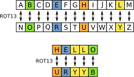

# Crypto Warmup 2

**Category:** Cryptography

**Points:** 75

## Task

>  Cryptography doesn't have to be complicated, have you ever heard of something called rot13? cvpbPGS{guvf_vf_pelcgb!} 

## Hints

> This can be solved online if you don't want to do it by hand!


## What do we need to know?

Another simple "getting started" cipher for us to look at.
Here we are being taught about the [ROT13 cipher](https://en.wikipedia.org/wiki/ROT13).
Wikipedia even has a pretty graphics for it:

<div style="text-align:center">

<br>**Figure:** Wikipedia image for ROT13 cipher
</div>

The neat idea behind ROT13, is that with the english alphabet of 26 characters, each letter is rotated to a single other letter, and when rotated again becomes the original character.
So the encryption algorithm (rotate 13 places) are also the decryption algorithm (rotate 13 places).


## Solution

With the cipher: cvpbPGS{guvf_vf_pelcgb!}, we could use an [online tool](https://www.rot13.com/) (which actually was before wiki in my search results for ROT13), or we can write a small [python script](./Solution/rot13.py) to do it for us.

There are two things to note here:
* We need to translate upper-case letters to upper-case letters, and lower-case needs to stay lower-case 
* Everything that is NOT in the english alphabet (numbers,spaces, commas, exclamationmarks, etc.) are not converted, and will stay the same in the encoded and decoded messages. 

First we create the translation, using [str.maketrans](https://docs.python.org/3.7/library/stdtypes.html?highlight=maketrans#str.maketrans):

```python
rot13 = str.maketrans( 
    "ABCDEFGHIJKLMNOPQRSTUVWXYZabcdefghijklmnopqrstuvwxyz", 
    "NOPQRSTUVWXYZABCDEFGHIJKLMnopqrstuvwxyzabcdefghijklm")
```

Think of it like a dictionary. We go through the inputstring to translate and replace everything we encounter with the translated counterpart.

```python
cipher = "cvpbPGS{guvf_vf_pelcgb!}"
message = cipher.translate(rot13)
print(message)
```

Next we add our supplied cipher for the challenge, and decode the message, and print it. 

## Flag

> picoCTF{this_is_crypto!}


 